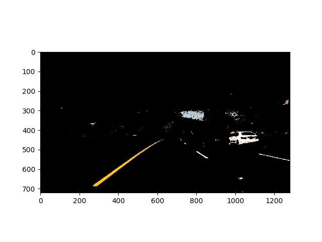
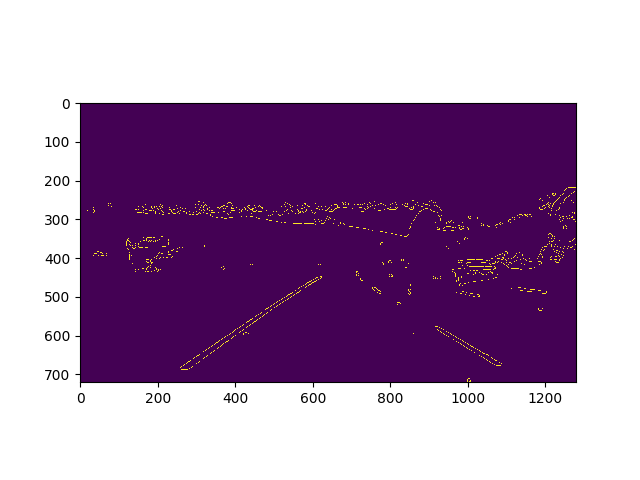
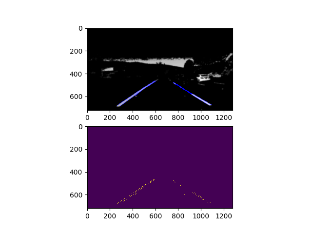

**Finding Lane Lines on the Road**
---

Assigment 1 for udacity SDC nanodegree.
The goals / steps of this project are the following:
* Make a pipeline that finds lane lines on the road
* Reflect on your work in a written report

**Requirements** <i class="icon-cog"></i>
-------------

 - Python3
 - Numpy
 - **Sklearn**
 - MoviePy
 - OpenCv (cv2)
 - Matplotlib

All should be available via pip install

--------
**Usage**
------
on Linux:
git clone / download the repo and cd into it.
> $ **python3 videoPipeline.py** -i *input_video.mp4*  -o *output_video.mp4*

---

### Reflection

### Pipeline Description: As part of the description, explain how you modified the draw_lines() function.

My pipeline consisted of 5 steps:

#### 1. Color Segmentation:
    Selecting white and yellow pixels from source frame.
    Switched to HLS colour space (easier to find thresholds here)
    Set thresholds for both, and found all pixels that fell in either.
    All other mixels were masked black, then the image was grey scaled

#### 2. Edge Detection

	 Gaussian blurred the frame to reduce the gradient of 'false' edges so they aren't detected.
	 Used canny edge detection to find all strong gradients within hysterasis threshold
 
#### 3. Masking and Hough Transformation
    A trapezoidal mask over the expected area of the lanes specified and zeros all pixels outside it.
    This masked image then feeds into a hough transform to fit straight lines to the remaining edges.

    The rho parameter must be sufficiently low that 2 edges of the same line are parameterised together
 
#### 6. Line Clustering
    The straight lines are multiple tiny fragments of the lane lines.
    To get just 2 (left and right), I find 2 K-Means averages of gradient and intercept among all lines
#### 7. Temporal Smoothing
    The left line was separated from the right by checking whether the gradient was positive/negative
    The lines were saved and averaged with previous lines.

    If a line was lost, its previous value was retained

### 2. Identify potential shortcomings with your current pipeline

- **Parameter tuning**: All pipeline stages would have benefitted from more tuning to reduce the jitter
- **Optimisation**: All code were naive implementations of ideas with lots of redundant calculations
- **Corners**: This assumed we were dealing with straight(-ish) roads as shown in the examples
- **Obstacles**: If an object entered both mask ranges (eg a white car in front of us), Hough transform would fail

### 3. Suggest possible improvements to your pipeline

- **Stronger temporal smoothing**: longer filters, and a better algorithm; perhaps leaky integration
- **Extrapolation**: in the event of losing a line, extrapolate its parameters using history in the temporal filter
- **Directional gradients**: Find whether the gradient was rising or falling in canny edge detection, split this into 2 hough transforms for each and pair rising/falling lines in close proximity to have a stronger confidence that a line is a line and not a rogue edge
- **Search Space Segmentation**: Split search space into 2 or 3 and parameterise multiple lines for each to deal with curves
Another potential improvement could be to ...
